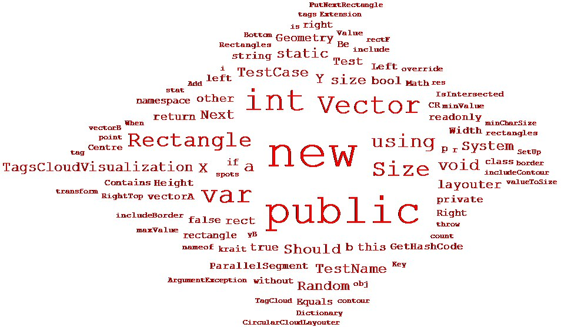
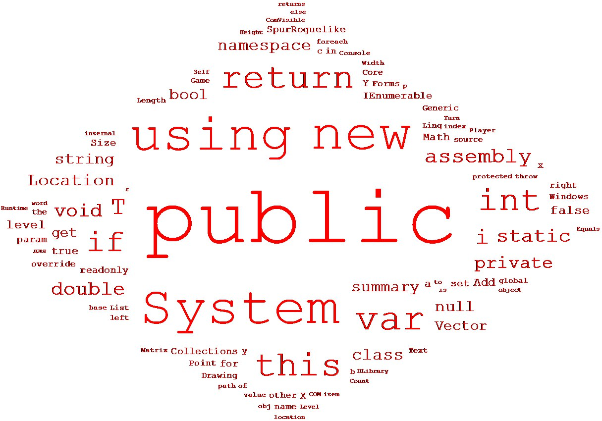
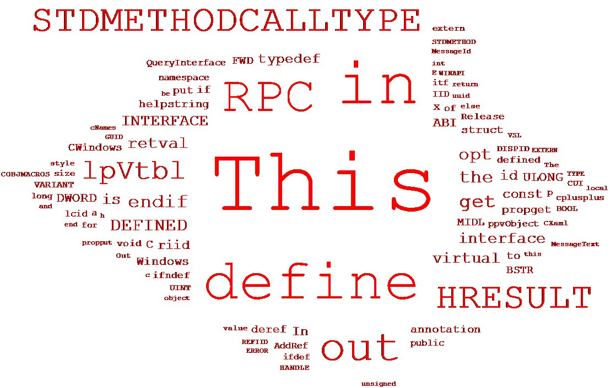
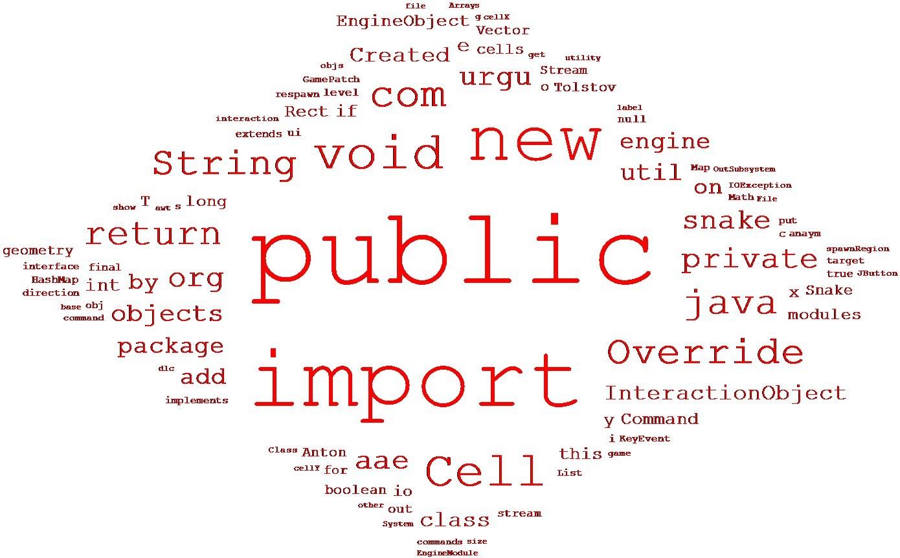
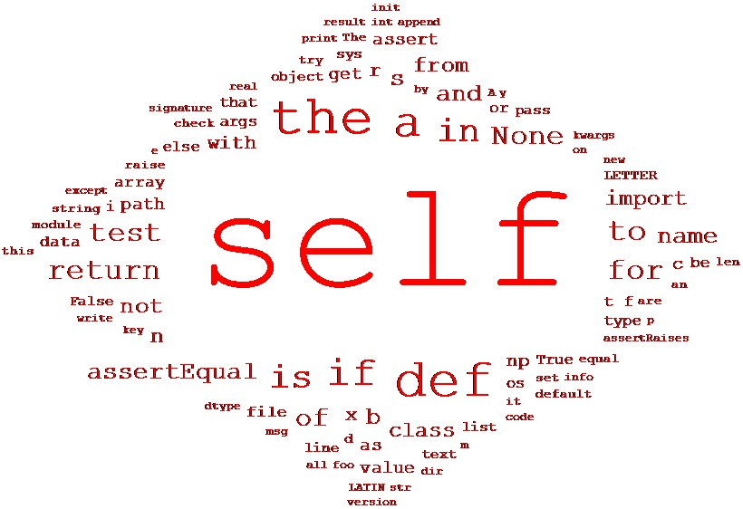
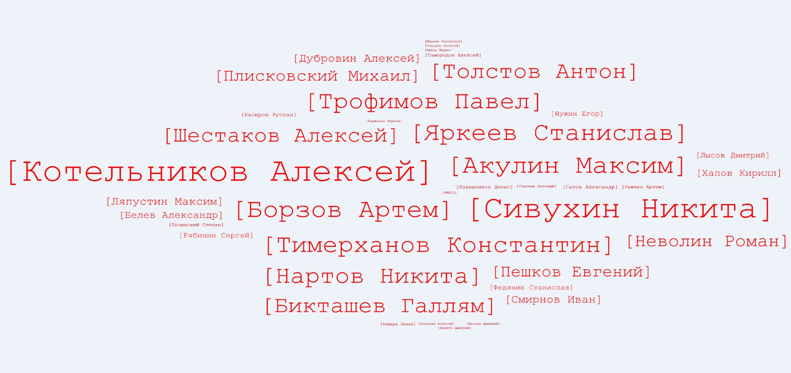
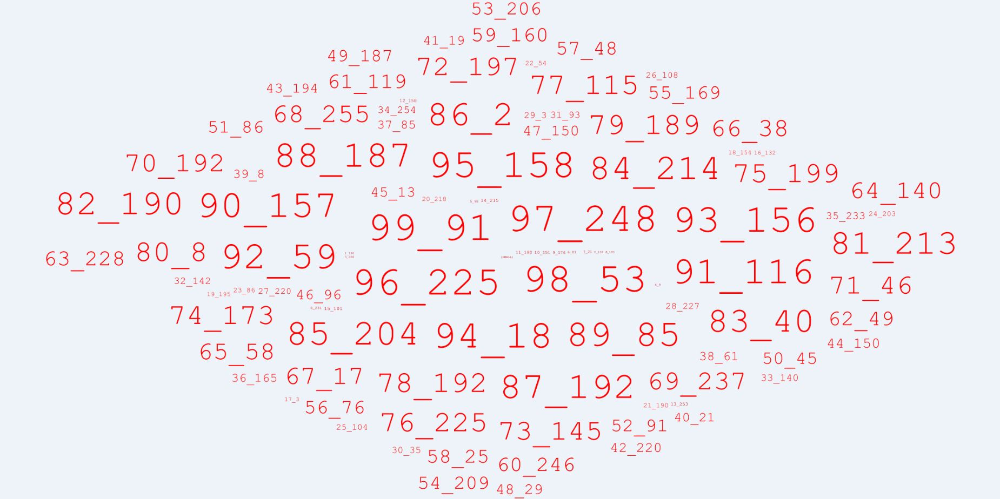

Tag Cloud Renderer
===================

В данном проекте реализован функционал рендеринга облака тегов
К сожалению, временно, теги задаются только программно

----------

Примеры рендеринга
-------------

